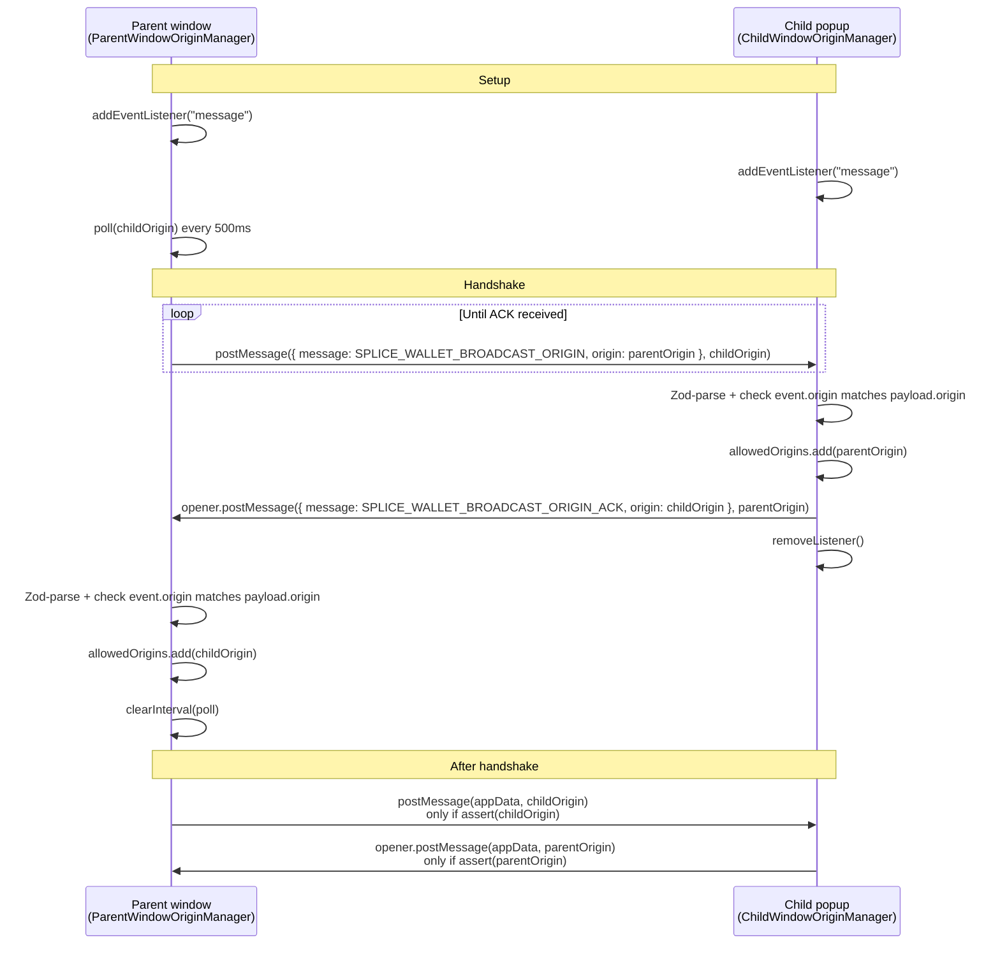

# @canton-network/core-origin-manager

This package provides a secure cross-window communication mechanism for verifying the origin of messages in a browser environment. It implements a handshake protocol to validate and track allowed origins before permitting inter-window communication.

## Installation

```sh
pnpm add @canton-network/core-origin-manager
```

## Overview

The origin-check package provides origin validation for secure cross-window communication in browser applications. It uses a bidirectional handshake protocol to establish trust between parent and child windows before allowing message passing.

## Handshake flow

1. Parent starts polling a known child origin with `SPLICE_WALLET_BROADCAST_ORIGIN`.
2. Child validates the message, allowlists the parent, replies with `SPLICE_WALLET_BROADCAST_ORIGIN_ACK` via `window.opener`, then stops listening.
3. Parent allowlists the child and stops polling.
4. Both sides only send application messages to origins that completed the handshake.



## Key Components

### [OriginHandshake](./src/types.ts)

A Zod-validated schema defining the structure of origin handshake messages. Contains:

- `message`: The type of handshake message (`SPLICE_WALLET_BROADCAST_ORIGIN` or `SPLICE_WALLET_BROADCAST_ORIGIN_ACK`)
- `origin`: The origin string being communicated

### [OriginManager](./src/manager.ts)

Abstract base class that manages origin validation through a message-based handshake protocol. Provides:

- Automatic listener registration for `window.message` events
- Origin allowlist management
- Message validation using Zod schemas
- `assert(origin)`: Check if an origin is allowed
- `postMessage(message, origin)`: Send a message to an allowed origin (safely validates origin first)
- `removeListener()`: Clean up the message event listener

### [ParentWindowOriginManager](./src/manager.ts)

Extends `OriginManager` for use in parent windows. Features:

- `postMessage(message, origin)`: Send a message to the child window (only succeeds if handshake completed). Initiates polling to establish connection with a child window for the first time.
- Automatically clears polling intervals upon successful handshake

### [ChildWindowOriginManager](./src/manager.ts)

Extends `OriginManager` for use in child windows. Features:

- Constructor accepts an optional `parentWindow` parameter (defaults to `window.opener`)
- `postMessage(message)`: Send a message to the parent window (only succeeds if handshake completed and parentWindow exists)
- Automatic handshake acknowledgment when receiving origin broadcasts
- Cleans up listeners after successful handshake

## Usage

### Parent Window Example

```typescript
import { ParentWindowOriginManager } from '@canton-network/core-origin-check'

// Create a manager instance
const originManager = new ParentWindowOriginManager()

// Send a message using the safe postMessage method
// This will initiate polling if connection is not established,
// and send the message once the handshake is complete
const childOrigin = 'https://child.example.com'
originManager.postMessage({ type: 'greeting', data: 'hello' }, childOrigin)

// Or manually check before sending
if (originManager.assert(childOrigin)) {
    window.postMessage(data, childOrigin)
}
```

### Child Window Example

```typescript
import { ChildWindowOriginManager } from '@canton-network/core-origin-check'

// Create a manager instance with optional parent window parameter
const originManager = new ChildWindowOriginManager()
// or specify a parent window explicitly:
// const originManager = new ChildWindowOriginManager(parentWindow)

// The handshake is automatic; once complete, listener is removed

// Send a message using the safe postMessage method
// This will only succeed if the handshake is complete and parent window exists
originManager.postMessage({ type: 'response', data: 'world' })
```

## Security Considerations

- Always validate origins before posting messages across window boundaries
- The handshake protocol ensures that both sides confirm the other's origin
- Use `postMessage()` method to automatically validate origins before sending
- The `assert()` method checks if an origin has completed the handshake
- Attempting `postMessage()` to an unapproved origin will silently fail
- Call `removeListener()` to clean up event listeners when done
