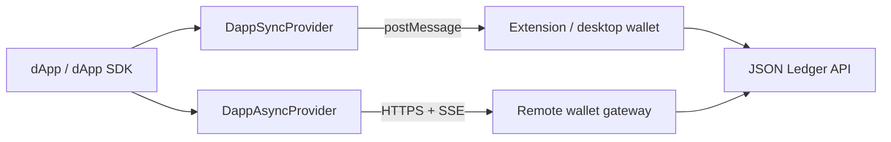

# @canton-network/core-provider-dapp

[CIP-103](https://github.com/canton-foundation/cips/blob/main/cip-0103/cip-0103.md)
**Provider** implementations for Canton dApps. Extends
[`@canton-network/core-splice-provider`](../splice-provider) with wallet-mediated access to
the dApp API (and proxied ledger calls).

Most applications should use
[`@canton-network/dapp-sdk`](https://www.npmjs.com/package/@canton-network/dapp-sdk), which
picks and wraps these providers. Use this package directly when building lower-level
integrations or custom discovery / transport wiring.

Published on [npm](https://www.npmjs.com/package/@canton-network/core-provider-dapp) under
Apache-2.0.

## Install

```bash
npm install @canton-network/core-provider-dapp
```

## Providers

| Class               | API           | Typical wallet              | Transport                         |
| ------------------- | ------------- | --------------------------- | --------------------------------- |
| `DappSyncProvider`  | CIP-103 Sync  | Browser extension / desktop | `postMessage` (`WindowTransport`) |
| `DappAsyncProvider` | CIP-103 Async | Remote / custody gateway    | HTTPS RPC + SSE                   |



Both implement the same Provider surface (`request`, `on`, `emit`, `removeListener`). Method
and event types come from the generated OpenRPC clients
(`@canton-network/core-wallet-dapp-rpc-client` and
`@canton-network/core-wallet-dapp-remote-rpc-client`).

## Sync vs Async

**Sync** — user interaction is in-process (popup / extension). Methods return results
directly.

**Async** — user interaction cannot block. Methods that need approval return a `userUrl`
(or similar) for the user to complete the action; the outcome arrives later as an event
(for example `connected`, `txChanged`, `messageSignature`).

|                  | Sync                                         | Async                                            |
| ---------------- | -------------------------------------------- | ------------------------------------------------ |
| Connect          | Returns session when ready                   | May return `userUrl`; `connected` after login    |
| `prepareExecute` | Completes in the request                     | Returns `userUrl`; progress via `txChanged`      |
| `signMessage`    | Returns signature                            | Pending / signed / failed via `messageSignature` |
| Events           | Wallet notifications on the window transport | Shared SSE stream from the gateway               |

## Usage

### `DappSyncProvider`

Defaults to a `WindowTransport` bound to `window`. Pass a custom `RpcTransport` when testing
or bridging a non-browser host.

```ts
import { DappSyncProvider } from '@canton-network/core-provider-dapp'

const provider = new DappSyncProvider()

provider.on('statusChanged', (status) => {
    console.log('connected:', status.connection.isConnected)
})

const { isConnected } = await provider.request({ method: 'isConnected' })
if (!isConnected) {
    await provider.request({ method: 'connect' })
}

const accounts = await provider.request({ method: 'listAccounts' })
```

### `DappAsyncProvider`

Point at the remote gateway base URL. An optional session token opens the SSE event stream
immediately; after IDP auth in a popup, the provider updates the token and reconnects SSE.

```ts
import { DappAsyncProvider } from '@canton-network/core-provider-dapp'

const provider = new DappAsyncProvider('https://wallet-gateway.example.com')

provider.on('connected', (status) => {
    console.log('session ready', status)
})

provider.on('txChanged', (tx) => {
    if (tx.status === 'executed') console.log(tx.payload.updateId)
})

const connect = await provider.request({ method: 'connect' })
// If not already authenticated, open connect.userUrl for the user to log in.
```

## Events

Subscribe with `provider.on` / `provider.removeListener`. Payloads follow CIP-103 / the
OpenRPC event schemas.

| Event              | Sync | Async | When                                     |
| ------------------ | ---- | ----- | ---------------------------------------- |
| `statusChanged`    | yes  | yes   | Connection / session changes             |
| `accountsChanged`  | yes  | yes   | Parties added/removed or primary changes |
| `txChanged`        | yes  | yes   | `prepareExecute` lifecycle               |
| `connected`        | —    | yes   | Login completed after async `connect`    |
| `messageSignature` | —    | yes   | Async `signMessage` lifecycle            |

`DappSyncProvider` bridges wallet-pushed notifications from `WindowTransport` into the
provider listener map. `DappAsyncProvider` multiplexes a shared `EventSource` across
instances for the same gateway URL + token.

## `window.canton`

This package augments `Window` with an optional injected provider:

```ts
window.canton?: Provider<DappLedgerRpc>
```

`DappLedgerRpc` is the Sync dApp RPC map combined with Ledger `ledgerApi` operation types,
matching a full browser wallet injection that can both speak CIP-103 and proxy ledger calls.

## Related

| Package                                                      | Role                                      |
| ------------------------------------------------------------ | ----------------------------------------- |
| [`@canton-network/core-splice-provider`](../splice-provider) | Provider interface and `AbstractProvider` |
| [`@canton-network/core-provider-ledger`](../provider-ledger) | Direct JSON LAPI provider (no wallet)     |
| [`@canton-network/core-rpc-transport`](../rpc-transport)     | `WindowTransport`, `HttpTransport`, …     |
| [`@canton-network/dapp-sdk`](../../sdk/dapp-sdk)             | High-level SDK on top of these providers  |

## Specs

- Sync OpenRPC: [`openrpc-dapp-api.json`](../../api-specs/openrpc-dapp-api.json)
- Async OpenRPC: [`openrpc-dapp-remote-api.json`](../../api-specs/openrpc-dapp-remote-api.json)
- [CIP-103](https://github.com/canton-foundation/cips/blob/main/cip-0103/cip-0103.md)
