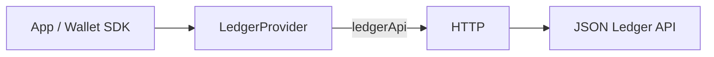

# @canton-network/core-provider-ledger

**Provider** for direct Canton JSON Ledger API access. Implements
[`@canton-network/core-splice-provider`](../splice-provider) with a single RPC-style method,
`ledgerApi`, backed by `@canton-network/core-ledger-client` over HTTP.

Works in Node.js and the browser. Typical use cases:

- Pass an instance into
  [`@canton-network/wallet-sdk`](https://www.npmjs.com/package/@canton-network/wallet-sdk)
  via `SDK.create({ ledgerProvider })` (or let the SDK construct one from
  `ledgerClientUrl` + auth).
- Call `ledgerApi` directly from tooling, scripts, or services that already have ledger
  credentials.

If you are building a Canton **dApp** that talks to a wallet, prefer
[`@canton-network/dapp-sdk`](https://www.npmjs.com/package/@canton-network/dapp-sdk)
(and [`@canton-network/core-provider-dapp`](../provider-dapp)) instead.

Published on [npm](https://www.npmjs.com/package/@canton-network/core-provider-ledger) under
Apache-2.0.

## Install

```bash
npm install @canton-network/core-provider-ledger
```

## Overview



- **Method:** `ledgerApi` only — params encode `resource`, `requestMethod`, and optional
  `body` / `path` / `query`
- **Transport:** HTTP (required by the Canton JSON Ledger API)
- **Auth:** any `AccessTokenProvider` from `@canton-network/core-wallet-auth` (static token,
  client credentials, self-signed, …)

## Usage

```ts
import { LedgerProvider } from '@canton-network/core-provider-ledger'
import type { AccessTokenProvider } from '@canton-network/core-wallet-auth'

const accessTokenProvider: AccessTokenProvider = {
    getAccessToken: async () => 'jwt...',
    getAuthContext: async () => ({
        userId: 'alice',
        accessToken: 'jwt...',
    }),
}

const provider = new LedgerProvider({
    baseUrl: 'https://ledger-api.example.com',
    accessTokenProvider,
})

const version = await provider.request({
    method: 'ledgerApi',
    params: {
        resource: '/v2/version',
        requestMethod: 'get',
    },
})
```

## Types

Due to some type inference limitations, the return type of request collapses to `unknown`. In order to aid the compiler, you can supply an optional type argument corresponding to the operation you are using on the ledgerApi. Afterwards, the response is cleanly typed:

```ts
import { LedgerProvider, Ops } from '@canton-network/core-provider-ledger'

const party = await provider.request<Ops.PostV2Parties>({
    method: 'ledgerApi',
    params: {
        resource: '/v2/parties',
        requestMethod: 'post',
        body: {
            partyHint: 'my-party',
        },
    },
})

console.log(party.partyDetails?.party)
```

Operation types are generated from the Ledger OpenAPI into a provider-oriented union (see
the typing notes in [`core/splice-provider`](../splice-provider/README.md#openapi-ledger-api)).

## Request data

Depending on the operation, supply one or more of:

```ts

provider.request({
    method: 'ledgerApi',
    params: {
        ...,
        body?: {
            // usually for POST requests (JSON object body)
        },
        path?: {
            // `path` arguments, usually for GET requests (i.e., `/v2/parties/{party-id}`)
            "party-id": "some-party-id"
        },
        query?: {
            // `query` params, usually for GET requests (i.e., `/v2/...?param=data`)
            "param": "data"
        }
    }
})
```

Let the operation type guide which fields are required.

## Related

| Package                                                      | Role                                         |
| ------------------------------------------------------------ | -------------------------------------------- |
| [`@canton-network/core-splice-provider`](../splice-provider) | Provider interface and `AbstractProvider`    |
| [`@canton-network/core-provider-dapp`](../provider-dapp)     | CIP-103 Sync / Async wallet providers        |
| [`@canton-network/core-ledger-client`](../ledger-client)     | Underlying JSON LAPI client                  |
| [`@canton-network/core-wallet-auth`](../wallet-auth)         | `AccessTokenProvider` implementations        |
| [`@canton-network/wallet-sdk`](../../sdk/wallet-sdk)         | Higher-level wallet tooling on ledger access |
