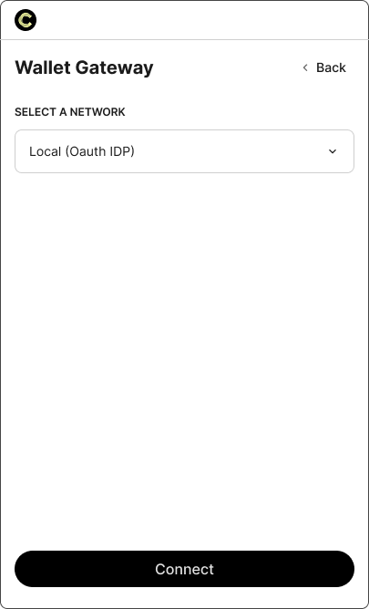
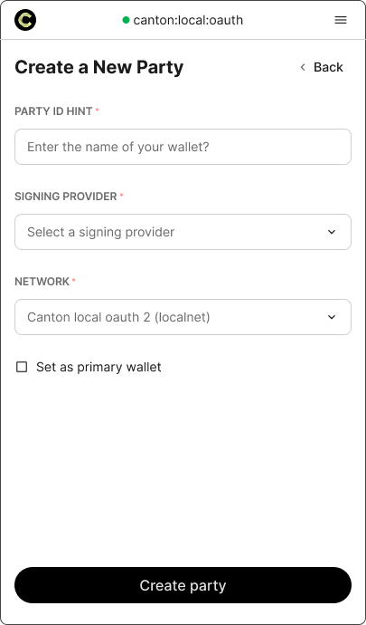
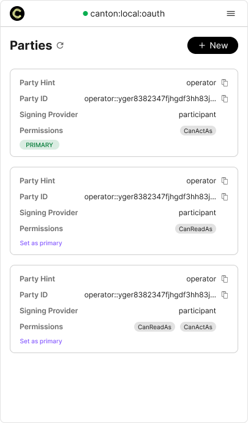

End users work with the Wallet Gateway through its **User UI**: a web app the Wallet Gateway
serves at its root URL. From it they log in, create and manage parties, review transactions, and approve
requests from dApps. This guide covers logging in and managing parties in the UI. To drive the
same operations from a script or backend, see
[Automate with the User API](../automation/automate-with-user-api.md).

> [!NOTE]
> The **dApp API** is separate. dApps call it through the [dApp SDK](../../dapp-sdk/overview.md)
> when a user connects a wallet; users never call it directly. See
> [dApp API](../reference/dapp-api.md).

## The User UI

The Wallet Gateway serves a web UI at its root URL (for example `http://localhost:3030`). Its
main pages are:

| Page           | Path          | What it does                                                                          |
| -------------- | ------------- | ------------------------------------------------------------------------------------- |
| **Login**      | `/login`      | Choose a network and identity provider, then sign in (OAuth redirect or self-signed). |
| **Parties**    | `/parties`    | List, create, and remove parties, and set the primary party. Default landing page.    |
| **Activities** | `/activities` | List of activities and view their status and details.                                 |
| **Approve**    | `/approve`    | Review and sign or reject a transaction a dApp requested.                             |
| **Settings**   | `/settings`   | Manage `/networks` and `/identity-providers`, view sessions, and see version info.    |
| **Callback**   | `/callback`   | Internal OAuth redirect target after login.                                           |

## Log in

1. Open the User UI and go to **Login** or **Connect**.
2. Select from the list of available CIP-0103-compliant providers or gateways. Or enter a custom remote gateway URL.
3. By selecting the **Wallet Gateway** option, a network of choice will be prompted. This network is associated with the connected validator or node, which needs to be configured within the validator or node settings.
   

4. Click **Connect** to authorize to view your parties.
    - **OAuth / OpenID Connect**: you are redirected to your provider and back.
    - **Self-signed**: a token is generated locally (development only).
5. On success you land on **Parties**. Unauthenticated users are redirected to **Login**
   automatically whenever a page needs a session.

> [!NOTE]
> The networks and IDPs you can choose from are configured by the operator. To add more, an
> admin manages them under **Settings** or in the configuration file. See
> [Networks & identity providers](../operate/networks-and-identity.md).

## Create a party

A wallet is a Canton **party** the Wallet Gateway manages for you on one network, signed by one
signing provider.

1. Navigate to the **Parties** list
2. Choose **+ New**
3. Provide the **Party ID** (or hint) for the wallet.
4. Select the **network** the wallet belongs to.
5. Select the **signing provider** that will hold the key and sign transactions for this
   wallet. See [Signing providers](../operate/signing-providers.md).
   

6. Optionally mark it as your **primary** wallet.
7. Choose **Create party**

Each wallet is tied to exactly one network and one signing provider, so you can keep different
parties on different networks or custody providers side by side in the same Wallet Gateway.

> [!WARNING]
> By the Parties header, you may click the refresh icon to reload your party list. If there is a party that was created outside of the Wallet Gateway, it may still appear but unable to access; showing a disabled status.

## Set the primary party

You can mark one wallet as **primary**. dApps that request your primary account receive this
wallet by default, so set it to the party you transact with most. Change it at any time on the
**parties** page.

1. Locate the desired party card (newer party cards located at the bottom of the list)
2. Select **Set as primary**
3. Verify with a green `Primary` tag

> [!WARNING]
> Changing your primary wallet changes which party dApps default to. Connected dApps are notified
> through the `accountsChanged` event and should re-read the primary account rather than caching
> it. See [dApp API](../reference/dapp-api.md).

## View activities

The **Activities** page lists transactions the Wallet Gateway has prepared, signed, or executed for
your parties, with their status and details. Reviewing and approving transactions that dApps
request happens on the **Approve** page — see
[Approve & sign transactions](approve-and-sign.md).

## Changing wallet providers

1. Select the hamburger icon on the top right and **Logout**.
2. Click **Login** or **Connect** in the dApp UI to trigger the pop-up.
3. Select a new provider to log into and follow its instructions.

## Sessions and logout

When you log in, the Wallet Gateway issues a **session** (a JWT) that authorizes your later
calls to the User and dApp APIs. Sessions are created on login and stored in the Wallet
Gateway's database.

Log out from the layout control. Logout ends the session (`removeSession`), clears local auth
state, and returns you to **Login** — or closes the window if the UI was opened as an approval
popup.

> [!NOTE]
> Sessions live in the Wallet Gateway's database. If the operator restores the database from a backup or
> loses it, active sessions may be invalidated and users must log in again. See
> [Networks & identity providers](../operate/networks-and-identity.md).

## Next steps

- [Approve & sign transactions](approve-and-sign.md): Review, approve, and track transactions dApps request.
- [Automate with the User API](../automation/automate-with-user-api.md): Drive wallet setup and transactions from scripts or a backend.
- [Networks & identity providers](../operate/networks-and-identity.md): Understand the networks and login options an operator configures.
- [Signing providers](../operate/signing-providers.md): See where each wallet's keys live and who signs.
