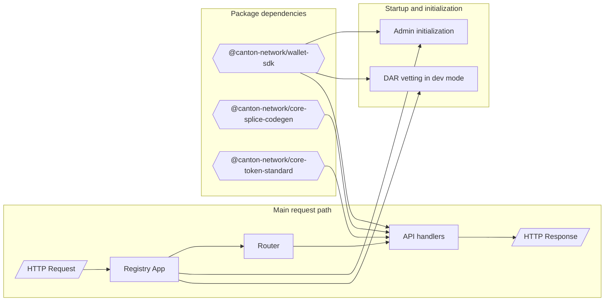

# @canton-network/example-test-token-v1-registry

Example backend registry implementation for CIP-0056 token flows on Canton.

## Overall Description

This project is a reference implementation of a token registry backend for the Test Token V1 standard. It exposes registry API endpoints for:

- token metadata
- transfer instructions
- allocations
- allocation instructions

### Purpose

- provides a reusable second CIP-0056 test token backend (beyond Amulet) so application tests do not become Amulet-specific
- reduces duplication across teams by offering a shared, easy-to-deploy testing token instead of requiring each team to build a token from scratch
- modernizes and harden the earlier prototype by aligning with current Wallet SDK usage and adding verification via automated tests
- provides practical coverage of registry-facing CIP-0056 workflows to complement on-ledger-only token examples

### App Logic Flow



## Getting Started

### Prerequisites

- Node.js 20+
- pnpm 11.x
- dependencies installed at repository root
- local Canton/localnet setup if you want full end-to-end behavior

### Installation

From repository root:

```bash
pnpm install
```

Build only this example:

```bash
pnpm --filter @canton-network/example-test-token-v1-registry build
```

Run in development mode:

```bash
pnpm --filter @canton-network/example-test-token-v1-registry dev
```

The API listens on `http://localhost:5634`.

## Project Structure

### Local Structure Overview

```text
examples/test-token-v1-registry/
  src/
    index.ts                          # app startup, admin init, dev vetting hook
    router.ts                         # route prefix to API handler mapping
    common/
      sdk.ts                          # Wallet SDK bootstrap/auth
      admin.ts                        # admin party initialization
      getOpenApiPath.ts               # OpenAPI source path resolution
    api/
      metadata/                       # metadata endpoints + tests
      transfer-instruction/           # transfer-instruction endpoints + tests
      allocation/                     # allocation endpoints + tests
      allocation-instruction/         # allocation-instruction endpoints + tests
      common.ts                       # shared API context typing helpers
    openapi-ts/                       # generated TypeScript types from OpenAPI
    scripts/
      generateTypes.ts                # regenerates openapi-ts bindings
    __test__/
      mocks.ts                        # test mocks
  vitest.config.ts                    # node+browser test projects and coverage
  tsup.config.ts                      # build configuration
  tsconfig.json
```

## Testing

Run tests:

```bash
pnpm --filter @canton-network/example-test-token-v1-registry test
```

Run tests with coverage:

```bash
pnpm --filter @canton-network/example-test-token-v1-registry test:coverage
```

Notes:

- tests are discovered under `src/**/*.test.ts`
- both node and browser projects are executed
- coverage thresholds are defined in `vitest.config.ts`

## Development & Contribution Guide

## @customize Flag

This example includes `@customize` comments in selected files.

What it is for:

- marks places that are intentionally project-specific
- highlights decisions made for this reference implementation that you will likely want to change in your own token backend
- acts as a migration checklist when copying this project into a new repository or package

When to look it up:

- right after copying/scaffolding this example for your own token
- before first production-like deployment
- when replacing test/demo behavior with your real business logic and infrastructure

How to use it:

1. Search the project for `@customize`.
1. Review each marked location and decide whether to keep, replace, or remove that logic.
1. Prioritize security, auth, persistence, and startup/init code paths first.

Development loop:

1. Modify API handlers and domain logic in `src/api/**`.
2. If API specs change, regenerate types:

    ```bash
    pnpm --filter @canton-network/example-test-token-v1-registry generate:types
    ```

3. Run tests and coverage.
4. Build before opening a PR.

General contribution guidelines for the monorepo: [Contributing Guide](https://github.com/canton-network/wallet/blob/main/docs/CONTRIBUTING.md)

## 6. License

Apache-2.0

## 7. Additional Resources

- [Wallet Repository](https://github.com/canton-network/wallet)
- [dApp Building Documentation](https://github.com/canton-network/wallet/tree/main/docs/dapp-building)
- [Wallet Integration Guide](https://github.com/canton-network/wallet/tree/main/docs/wallet-integration-guide)
- [CIP Repository (including CIP-0056 context)](https://github.com/canton-foundation/cips)

## 8. Bug Reporting

If you find a bug:

1. Open an issue at: [canton-network/wallet issues](https://github.com/canton-network/wallet/issues)
1. Include reproduction steps, expected behavior, and actual behavior.
1. Attach logs and relevant request/response payloads when possible.

If issue templates are available in the repository, prefer using the most specific template.
